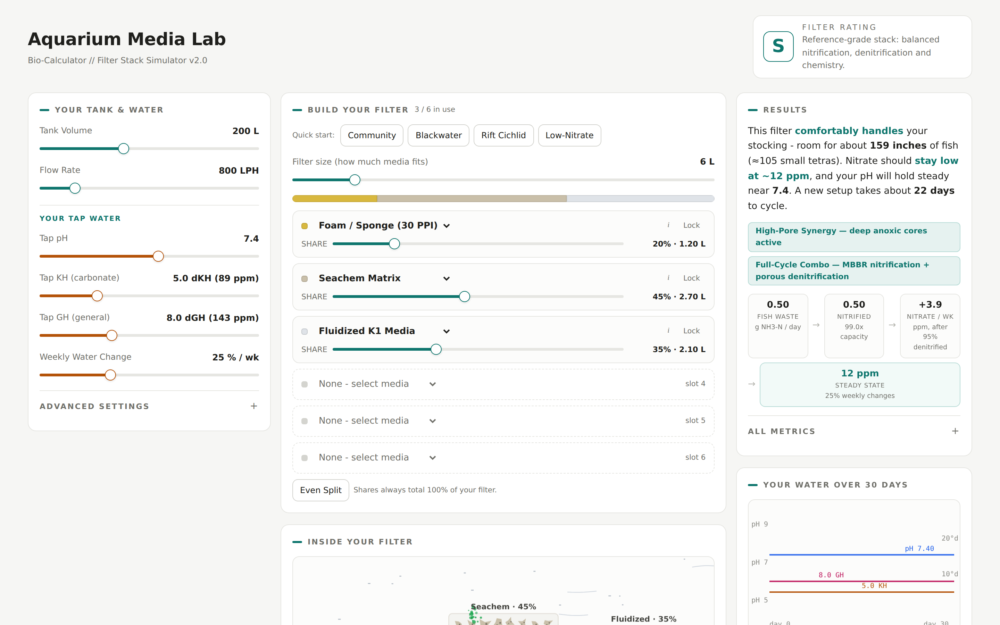
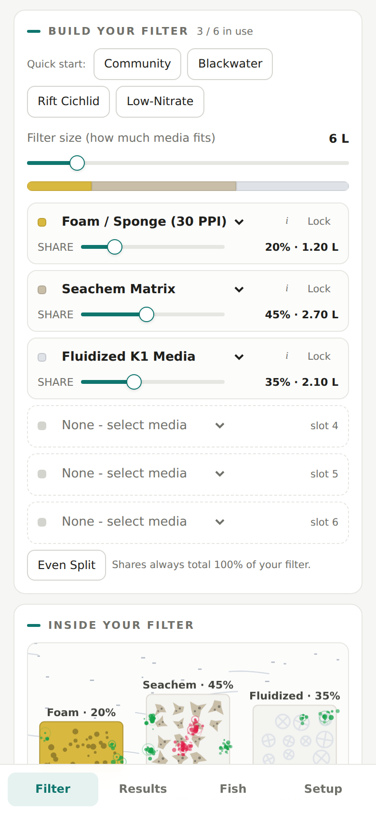
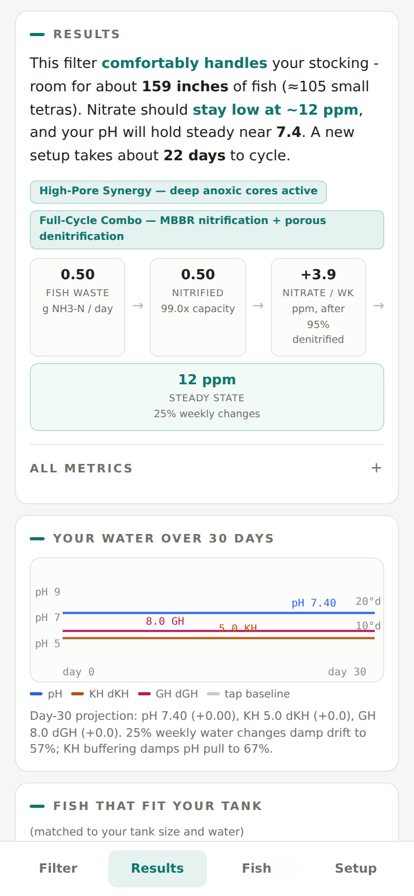
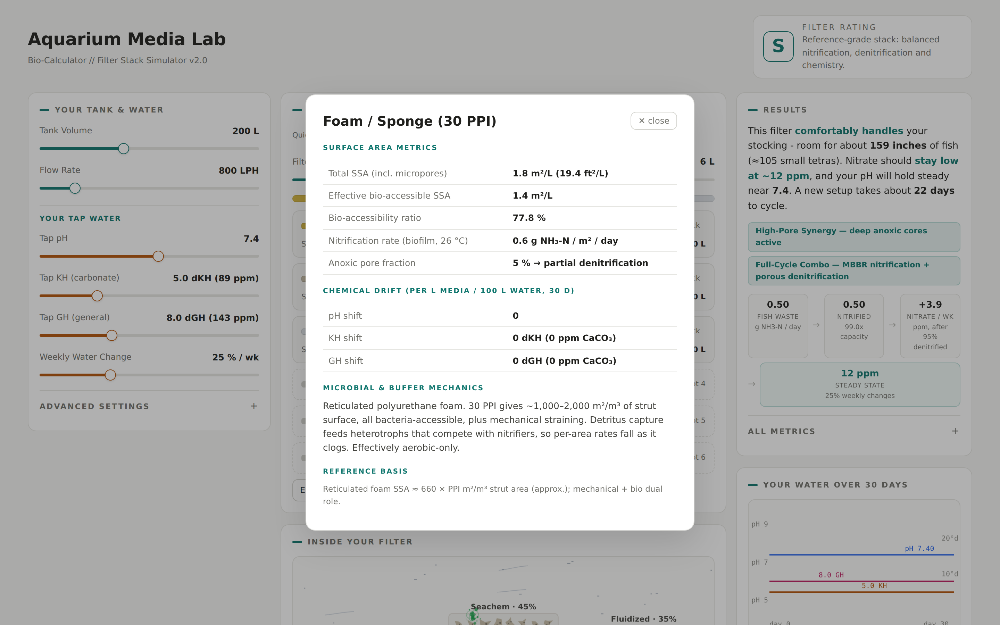
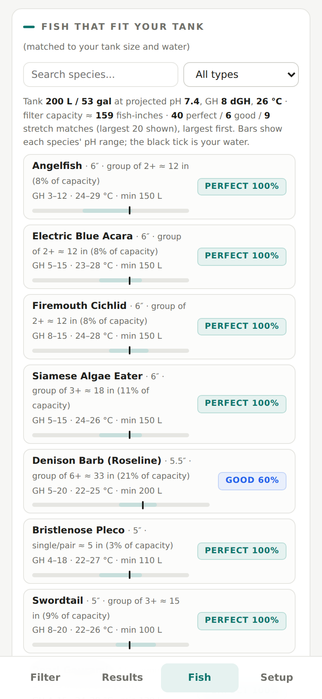
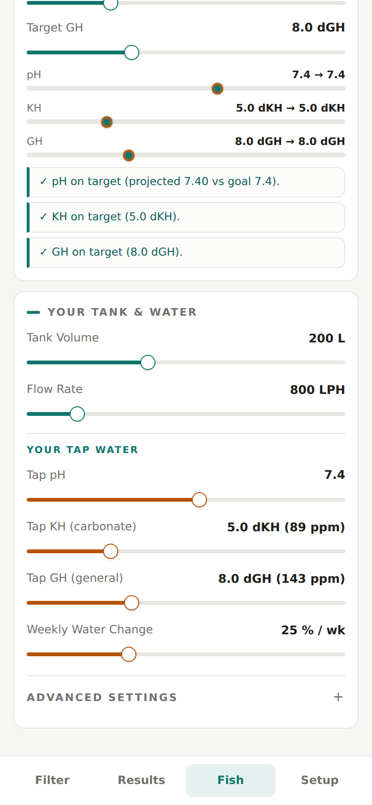

# Aquarium Media Lab

> **An interactive filter-media bio-calculator and water chemistry simulator** — build a virtual filter stack and watch nitrification capacity, 30-day water chemistry, and livestock compatibility respond in real time.

**Live app:** https://jfan2807.github.io/filter.io/ — installable as an offline PWA on iPhone, Android and desktop.

---

## Overview

Choosing aquarium filter media is usually marketing-driven guesswork. Aquarium
Media Lab replaces it with an engineering model: 12 researched media types with
real surface-area, nitrification-rate, anoxic-pore and pH/KH/GH drift data, a
6-slot filter stack whose shares always total 100% of your filter's capacity,
and a simulation that projects fish-waste processing, steady-state nitrate and
a 30-day chemistry trajectory from your actual tap water.

Everything runs client-side in one self-contained HTML file — no build step, no
external dependencies — and installs as an offline PWA on iPhone, Android and
desktop.

---

## Feature Showcase

### The Lab

*Desktop three-column layout: tank and tap-water inputs on the left, the 6-slot filter stack builder with quick-start presets in the middle, and live results on the right — an S–F filter rating, synergy badges (deep anoxic cores, MBBR + porous denitrification combos), the waste-processing pipeline, and steady-state nitrate under your water-change schedule.*

### Filter Stack Builder & Live Visualizer

*The stack builder on mobile: preset stacks (Community, Blackwater, Rift Cichlid, Low-Nitrate), a filter-size slider, and per-slot share sliders that rebalance so media always totals 100%. Below, the "Inside Your Filter" visualizer animates each medium to scale — biofilm bacteria in green, heterotrophs in rose — at a speed driven by your flow rate.*

### Results & 30-Day Chemistry Projection

*Plain-language results ("comfortably handles ~159 inches of fish… nitrate holds at ~12 ppm… cycles in about 22 days") backed by a waste-processing pipeline and a 30-day pH/KH/GH trajectory chart that accounts for weekly water changes and KH buffering.*

### Science Cards

*Every medium has an evidence card: total vs bio-accessible surface area, nitrification rate at temperature, anoxic pore fraction, per-litre chemistry drift, microbial mechanics, and the literature basis for each figure.*

### Livestock Matching

*65 freshwater fish and invertebrates scored against your tank volume, projected pH/GH and filter capacity — perfect/good/stretch tiers, group-size stocking maths in fish-inches, and a pH-range bar with a tick marking your projected water. Searchable and filterable by category.*

### Chemistry Advisor

*Set pH/KH/GH targets and the advisor issues quantitative dosing: grams of baking soda, remineralizer amounts, RO mixing ratios, or media-share changes — with per-parameter checkmarks once the projection lands on target.*

---

## Under the Hood

1. **Literature-derived media model** — each medium carries total and
   bio-accessible specific surface area, biofilm nitrification rate with
   temperature kinetics, anoxic pore fraction for denitrification, and
   per-litre pH/KH/GH drift; synergy detection rewards stacks that combine
   MBBR nitrification with porous denitrification.
2. **Steady-state chemistry simulation** — fish waste → nitrification →
   denitrification → nitrate accumulation, damped by weekly water changes and
   KH buffering, projected over 30 days against your tap-water baseline.
3. **Quantitative advisor** — not "add some buffer" but grams, ratios and
   share percentages computed from the same model the simulation runs on.
4. **Zero-dependency engineering** — one HTML file, hand-rolled canvas charts
   and particle visualizer, scroll-spy section nav on mobile, service-worker
   offline support and installable PWA.

---

## License

This is a public showcase repository — it contains the project README and
feature screenshots only. The source code is private; access can be arranged
on request for portfolio review. All rights reserved.
